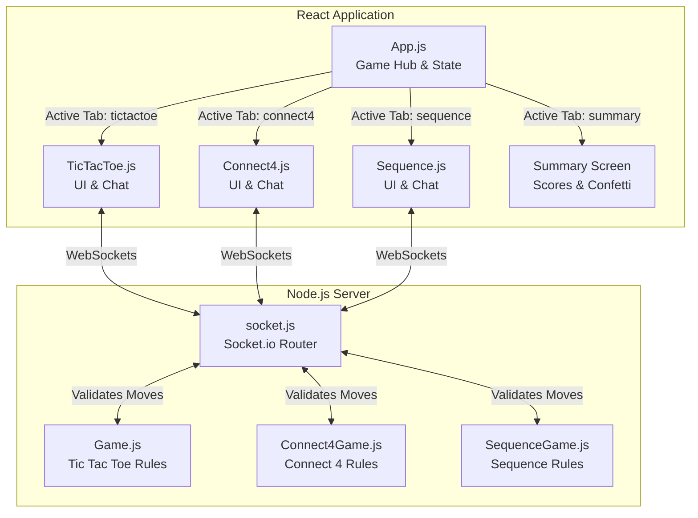
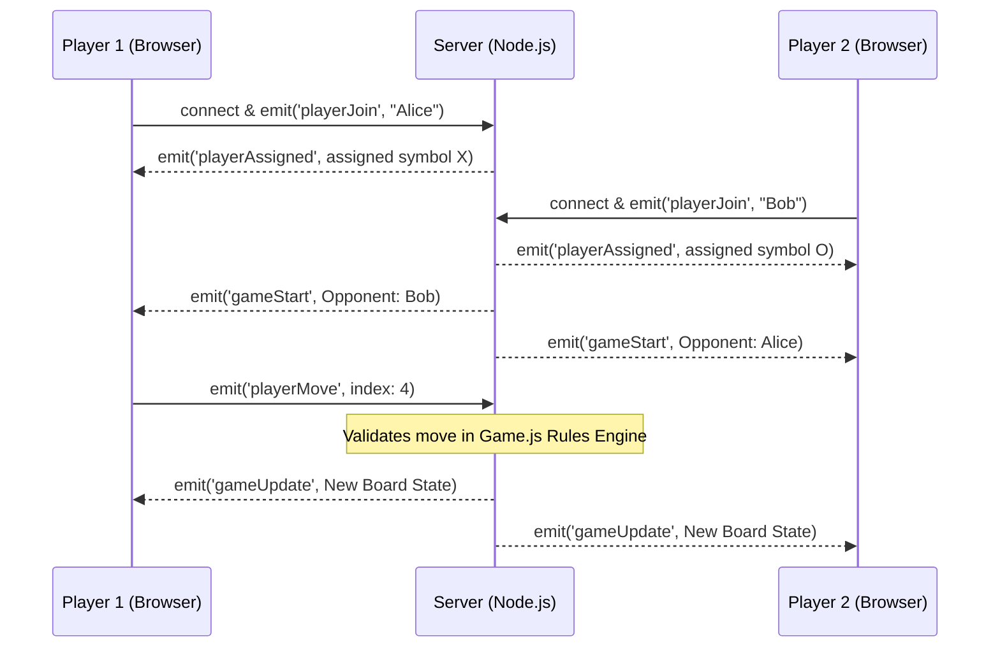

# Game Hub Architecture & Workflow

This document maps out the architecture and component connections of the React Game Hub to make it easier to understand and maintain.

## 1. Project Component Structure

The application has been modularized and upgraded into a fully networked multiplayer hub:
- **`App.js`**: The **Game Hub Wrapper**. It manages the sidebar navigation, cross-game score tracking, global player names, background music, and the End & Summary dashboard (with Confetti!).
- **`TicTacToe.js`**: Contains the Socket.IO client logic and React UI for Tic Tac Toe (using 🔴 and 🔵 emojis).
- **`Connect4.js`**: Contains the Socket.IO client logic and React UI for Connect 4 (using 🍎 and 🥭 emojis).
- **`Sequence.js`**: Contains the Socket.IO client logic and React UI for Sequence 5-in-a-row (using 🦊 and 🐸 emojis).
- **`Game.js`, `Connect4Game.js`, & `SequenceGame.js` (Backend)**: The authoritative rule engines running on the Node.js server that validate all moves and determine winners.

## 2. Component Workflow Diagram

Below is a high-level mapping showing how the Front-End (React) interfaces with the Back-End (Node.js).

## 3. Multiplayer Matchmaking Sequence (Tic Tac Toe)

This specific sequence describes how Socket.IO passes payloads between two separate browser clients during the Tic Tac Toe loop.

## 4. State Management Principle
- **Connect 4** uses purely local state (`useState`) since it is a pass-and-play game located on the exact same screen instance.
- **Tic Tac Toe** pushes all UI moves to the Node.js server. The backend acts as the **single source of truth** so neither client can cheat!