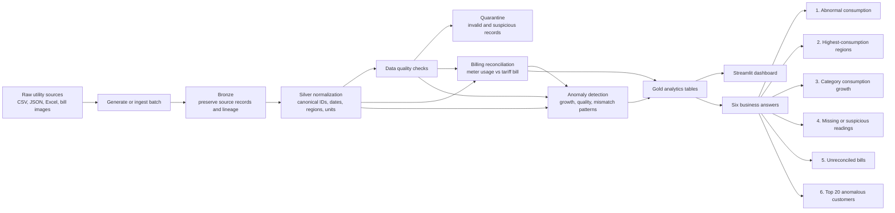

# Project Workflow

The project can be rendered as a Mermaid flowchart in GitHub, VS Code Markdown preview, or any Mermaid-compatible Markdown viewer.



## Run the workflow locally

From the workspace root:

```bash
source .venv/bin/activate
python messy-utility-customer-analytics/scripts/generate_synthetic_data.py
pytest messy-utility-customer-analytics/tests -q
streamlit run messy-utility-customer-analytics/dashboard/app.py
```

The pipeline writes curated Parquet files and the six answer CSVs under `data/silver/`, `data/gold/`, and `data/quarantine/`.